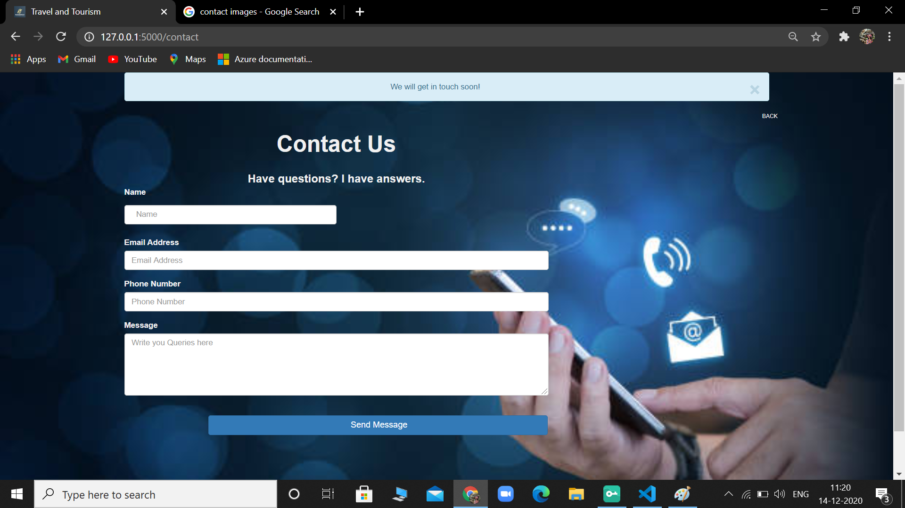

# TRAVEL AND TOURISM :airplane: :hotel: :mountain_railway:
### Database Based Web Application which focuses on Booking and managing Tour for Customer ,Implemented using Flask, Sqlite3,SqlAlchemy,Html,Css,JS
---
##### Customer can choose Package,Accomandation,Transportation according to their preference and can pay for it as whole.
----
##### Register and Login Page  

  
  
  

 

___________

##### Packages  

  
  
  
  
  
  
  
  
  
  
  

 

__________

###### Admin Dashboard  

  
   
  

  
   
  

